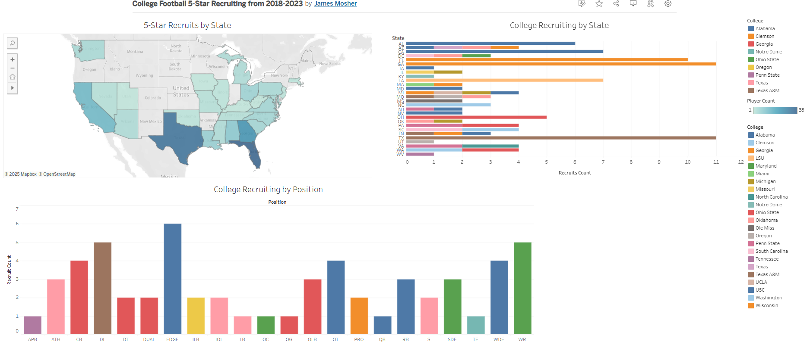

# College Football Recruiting Dashboard (Tableau)

## Overview
This Tableau dashboard explores college football 5-star recruiting trends across the United States. The dashboard provides visual insights into position-specific recruiting dominance, talent-producing states, and college recruiting activity by state.

View the dashboard live here: [Tableau Public Link](https://public.tableau.com/app/profile/james.mosher/viz/cfb_project/recruiting_dashboard)

---

## Data Sources

All data used for Tableau visualizations was generated from PostgreSQL queries in pgAdmin.

cfb_q1.csv: College Recruiting by State

cfb_q2.csv: 5-Star Recruits by State

cfb_q3.csv: College Recruiting by Position

---

## Key Insights

### 1. Position-Specific Recruiting Dominance
- Identifies which colleges dominate recruiting for specific positions

---

### 2. Top States Producing Highest Talent
- Maps the states producing the most 5-star recruits.

---

### 3. College Recruiting by State
- Displays the most active recruiting programs within each state.

---

## Tools/Sites Used
- Kaggle
- Excel
- pgAdmin
- Tableau Public

---

## Screenshot

---

## Insights & Observations
- The SEC dominates positional recruiting for defensive positions.
- Texas, Florida, and Georgia lead the country in producing elite-level talent.
- Some programs have a strong regional recruiting footprint, while others recruit nationally.

---

## Additional Notes

This was my first attempt at data analysis from start to end. I used a dataset from Kaggle, cleaned it in Excel, queried it in pgAdmin, then created a dashboard in Tableau and uploaded it to Tableau Public as well as GitHub.

I need to be more intentional with my problem statement and the dataset I select. I think I cleaned the data in Excel too much, so that there wasn't enough to query in pgAdmin. I need to incorporate CTEs, window functions, JSONs, and arrays into my queries, but I'm not at a point where I can write these confidently, so I used ChatGPT to assist me in the process.

This was challenging, but I got a lot of experience with different aspects of the workflow, such as:

-postgreSQL server must be running in Services before pgAdmin can connect to it

-you can use Git Bash as a CLI to access psql to query data and create tables(I used this method to create a table and then import the table data from a .csv file)

-difference between visualizations, dashboards, and stories

-focus on creating interactive dashboards that you can explain, yet people can access and use themselves

-had issues running queries with pgAdmin and had to download a patch to resolve the problem

-pgAdmin replaces empty fields with NULL automatically

-only the paid version of Tableau allows you to connect to postgreSQL server directly(although workaround isn't challenging)

-good understanding of SQL, but need more experience creating more complex queries(CTE, window function, JSON, array)

---

## Author
Created by [James Mosher](https://www.linkedin.com/)

